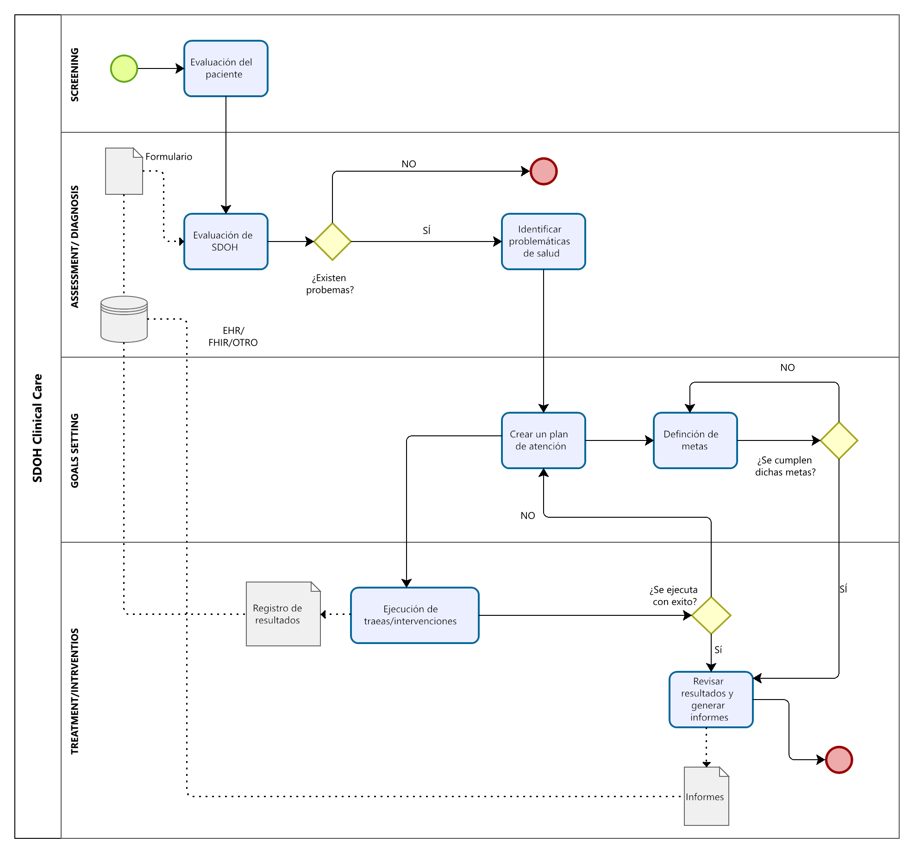
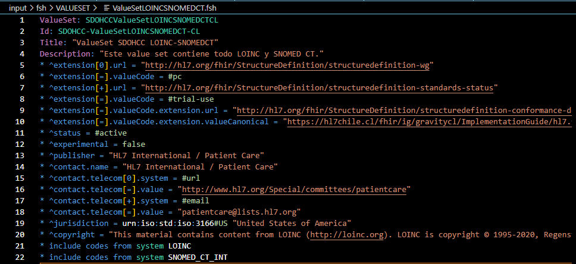
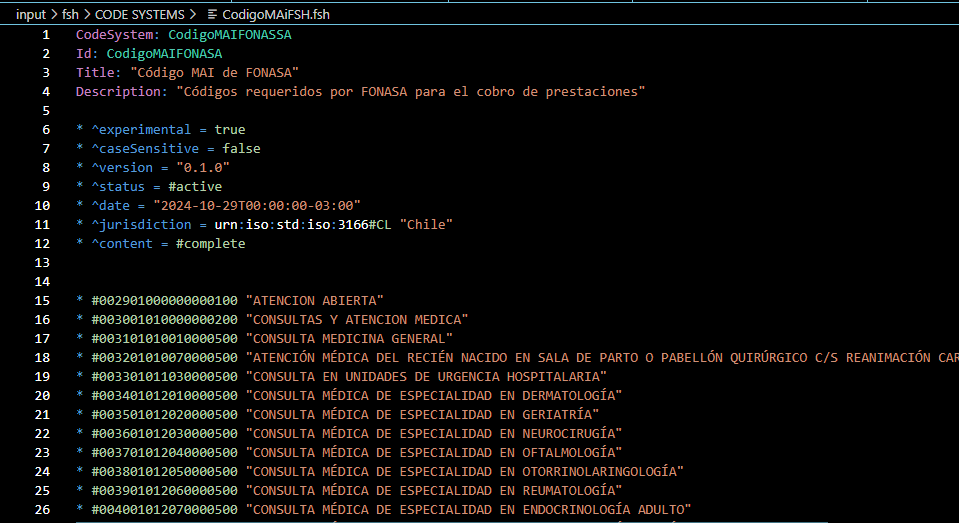
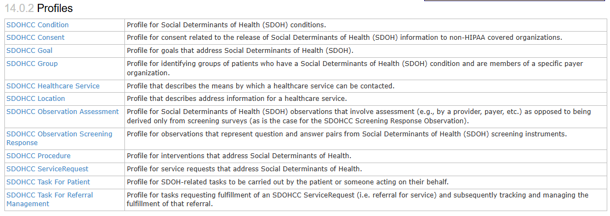
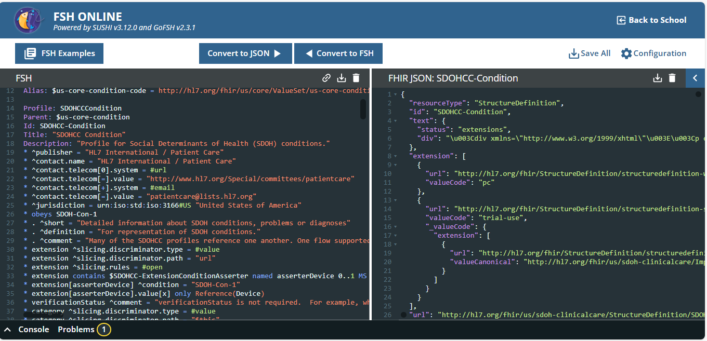
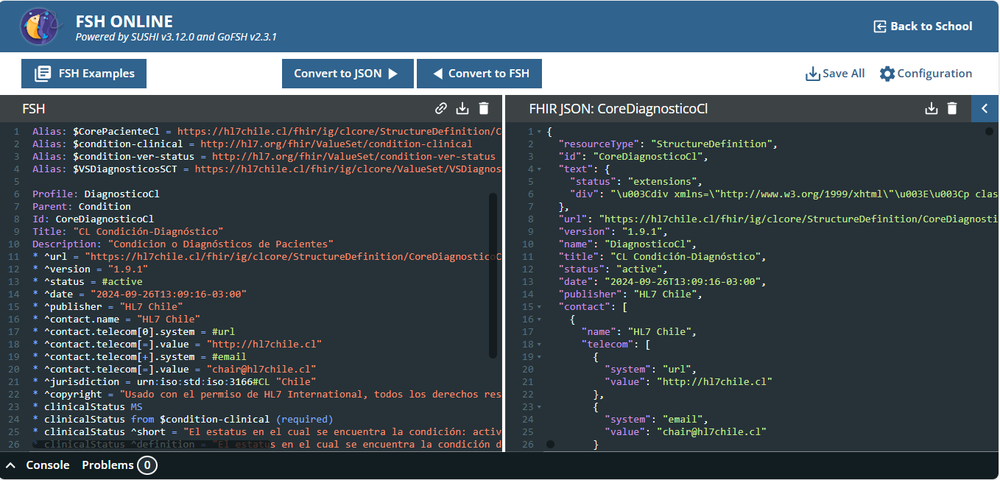
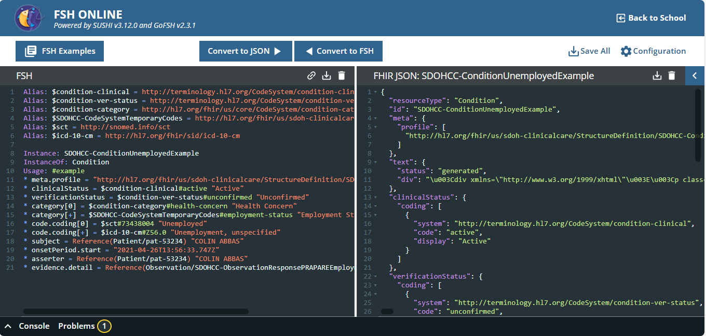
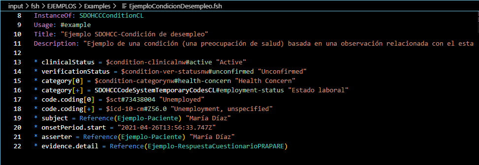

# Desarrollo de un modelo de interoperabilidad para determinantes sociales de la salud nacional 

La OMS define los **Determinantes sociales de la salud (SDOH)** como las condiciones de los entornos donde las personas nacen, viven, aprenden, trabajan, juegan, practican su religión y envejecen, que afectan una amplia gama de resultados y riesgos en materia de salud, funcionamiento y calidad de vida, por ende, la salud no solo está determinada por la atención clínica, sino también por las condiciones sociales en las que viven las personas. 

En Chile actualmente no existe una integración de estos factores con el sistema sanitario, aunque se manejan estadísticas aisladas proporcionadas por encuestas como la [CASEN](https://observatorio.ministeriodesarrollosocial.gob.cl/encuesta-casen-2022) (Encuesta de caracterización socioeconómica nacional) y la [ENS](https://epi.minsal.cl/resultados-encuestas/) (Encuesta nacional de salud). Estas encuestas recopilan datos sobre diversos aspectos, como demografía, trabajo, ingresos, educación, así como enfermedades y tratamientos que atravies la población.

En Estados Unidos, [Gravity Project](https://confluence.hl7.org/display/GRAV/Project+Information) busca desarrollar y promover estándares de datos abiertos utilizando HL7 FHIR y terminologías asociadas que forman la base de la interoperabilidad en la atención social moderna. Este proyecto introduce terminologías basadas en dominios o categorías de riesgo social y desarrolló una [Guía de Implementación completa](https://hl7.org/fhir/uv/subscriptions-backport/STU1.1/index.html) de derivaciones de circuito cerrado. 

A partir de la información presentada en la página del proyecto mencionada anteriormente, se identificó y desarrolló en Bizagi el diagrama del proceso, basado en la información disponible. 



El presente proceso describe una metodología estructurada para integrar los SDOH en la atención clínica, asegurando una atención personalizada y efectiva.
  * **Screening**: el flujo inicia con la evaluación del paciente, en la que se identifican factores relevantes relacionados con los determinantes sociales de la salud. Esta información se recolecta a través de un formulario, cuyos datos son almacenados en sistemas electrónicos como el EHR o FHIR, permitiendo su análisis porsterior.
  * **Assessment/Diagnosis**: En esta etapa, se realiza la evaluación de los SDOH, utilizando la información recolectada para determinar si existen problemáticas que puedan impactar la salud del paciente.
      * Si no se identifican problemas, el proceso finaliza.
      * En caso de detectarse problemáticas, se procede a la siguiente etapa para abordarlas.
  * **Goal Setting**: una vez identificados los problemas, se realizan las siguientes acciones:
      * Identificación de problemáticas de salud: se detallan los factores sociales que afectan al paciente.
      * Creación de un plan de atención: se desarrolla un plan personalizado, orientado a mitigar las problemáticas identificadas.
      * Definición de metas: se establecen objetivos claros y medibles que guiarán las intervenciones.
  Un punto crítico del proceso es la evalaución de estas metas:
    * Si no se cumplen, se ajustan las estrategias y se redefine el plan.
    * Si se cumplen, el flujo avanza hacia la implementación de las intervenciones.
  * **Treatment/Interventions**: en esta fase, se ejecutan las tareas o intervenciones definidas en el plan de atención. Posteriormente, se verifica si estas acciones fueron implementados con éxito:
      * Si las intervenciones no se ejecutan de manera adecuada, se reevalúan las tareas para corregir fallas.
      * Si son exitosas, se procede a la revisión de resultados y la generación de informes que consolidan el impacto de las acciones.
El flujo culmina con la emisión de los informes finales, que documentan los resultados obtenidos.Este ciclo permite un monitoreo constante y ajustes iterativos asegurando una atención de calidad centrada en las necesidades del paciente.

Al tratarse de una guía de implementación CORE, no fue necesario desarrollar el modelado ni flujo de datos correspondiente, ya que estos elementos no forman parte del alcance establecido. Del mismo modo, tampoco se consideró necesario el desarrollo de casos de uso, dado que la guía se enfoca en proporcionar lineamientos generales. 

## Construcción Guía de Implementación
En este apartado se describen los programas y metodología empleada para el desarrollo de la guía de implementación. El propósito es proporcionar una visión clara y estructurada sobre los enfoques adoptados, las herramientas utilizadas y los procesos seguidos para garantizar la coherencia, eficacia y aplicabilidad de la guía, facilitando la replicabilidad y la adptación del contenido, asegurando su utilidad práctica para los usuarios. 

### INSTALACIÓN DE SOFTWARES 
**IMPORTANTE:** Toda la intalación descrita debe ser en modo administrador.

#### 1. **Instalación Visual Studio Code**: 

Este es un editor de código fuente ligero y multiplataforma. Su proceso de instalación comprende los siguientes pasos:
  * Accede al sitio oficial de [Visual Studio Code](https://code.visualstudio.com/)
  *  Hacer clic en el botón **Download** según el sistema operativo.

   *Para Windows*:
     * Una vez descargado el instalador (VSCodeSetup.exe), ábralo.
     * Acepte términos de licencia y seleccione las siguientes opciones:
         * Crear un acceso directo en el escritorio.
         * Añadir VS Code al menú contextual o al PATH (opción recomendada para usar la terminal)
         * Haz clic en **Instalar** y espere que el proceso finalice.
         * Una vez completada la instalación, haga clic en **finalizar** para abrir el panel.
         * Al abrir Visual Studio Code, se debe instlar la extensión de Git.
Con esto, Visual Studio Code está listo para comenzar.

#### 2. Instalación "Java jdk": 
**Java Development Kit (JDK)** es un conjunto de herramientas escenciales para desarrollar, compilar, depurar y ejecutar aplicaciones en el lenguaje de programación Java. 
Para descargar: 
 * Visita el sitio de descarga de [Oracle](https://www.oracle.com/cl/java/technologies/downloads/).
 * Selecciona la versión de JDK adecuada para el sistema operativo. 
 * Acepta los términos de la licencia y descarga el instalador. 
 * Sigue las instrucciones de instalación para configurarlo en tu sistema.

#### 3. SUSHI :
SUSHI es una implementación de referencia y un estándar de *facto* para un compilador FSH que traduce FSH en artefactos FHIR como perfiles, extensiones y vale sets.

 - **Paso 1:** SUSHI requiere *Node.js*, para instalar diríjase a [Node JS](https://nodejs.org/en) y seleccione la descarga "LTS". Una vez descargado el instalador, ejecútelo utilizando las opciones predeterminadas.
Para asegurar una instalación correcta, abra una ventana de comandos y escriba los siguientes comandos, cada uno debe devolver un número de versión.

 ```
 node --version
 npm --version
 ```

 - **Paso 2:** Para instalar SUSHI, abra un símbolo del sistema y escriba el siguiente comando:

 ```
 npm install -g fsh-sushi
 ```
 Para verificar la instalación utilice: 

 ```
 sushi help
 ```
 Si el comando genera instrucciones sobre el uso de la interfaz de línea de comandos de SUSHI, está listo para ejecutar SUSHI. 
  Se utiliza *sushi -v* para mostrar la versión instalada de SUSHI y la versión de la especificación FSH que admite.

 - **Paso 3:** como herramientas de publicación se debe instalar Ruby Jekyll, la información se encuentra disponible en  [Jekyll](https://jekyllrb.com/docs/installation/windows/), y para realizar la descarga e instalación ingrese a [RubyInstaller](https://rubyinstaller.org/).
 **Nota:** Se recomienda instalar con las 3 opciones, una tras otra.
 Finalmente en una ventana de comandos escriba:
   ```
   gem install jekyll bundler
   ```

**RECOMENDACIÓN:**
Agregar "java" en las variables de entorno siguiendo los siguientes puntos:
 * Busque y ábra variables de entorno en su buscador de Windows.
 * Seleccione "variables de entorno".
 * En la ventana que se abrirá "Variables del sistema" seleccione "PATH" Y luego presione el botón "EDITAR".
 * En una nueva ventana emergente, seleccione el botón "EXAMINAR".
 * Busque la ruta donde se instala java (./java/bin) y seleccione "Variables de usuario" y seleccione el botón "Nuevo".
 * Finalmente cree una variable JAVA_HOME y busque la carpera correspondiente. 


### 3. Creación de perfiles
Para crear la estructura de directorios necesaria para el desarrollo de esta guía de implementación, se utilizó el comando *sushi init* tras haber instalado los programas previamente mencionados. Este comando generó la estructura base del proyecto. La organización inicial se basó en la guía de implementación [SDOH Clinical Care](https://build.fhir.org/ig/HL7/fhir-sdoh-clinicalcare/), estableciendo ademaás una dependencia con la guía [CL Core](https://hl7chile.cl/fhir/ig/clcore/1.9.1/index.html). Ambas guías proporcionaron una estructura que fue analizada y comparada para diseñar perfiles necesarios de manera adecuada. 

Para desarrollar los perfiles presentados en la guía de implementación *SDOH Clinical Care* en una primera instancia se desarrolló: 

**1. Value Sets**
Los value sets se emplean para definir terminologías relacionadas con los determinantes sociales de la salud, incluyendo conceptos clínicos como necesidades, intervenciones, resultados y otros datos relevantes. Estos value sets garantizan la estandarización en la captura y el intercambio de infromación, permitiendo la interoperabilidad entre diferentes sistemas de salud. 

| Value Sest Gravity | Value Sets GI nacional |
| ------------------ | ---------------------- |
| SDOHCC ValueSet LOINC SNOMEDCT | ValueSet SDOHCC LOINC-SNOMEDCT |
| SDOHCC ValueSet Observation Status | Valueset SDOHCC Estado de observación |
| SDOHCC ValueSet SDOH Category | ValueSet SDOHCC para Categoría SDOH |
| SDOHCC ValueSet SDOH Questionnaire Category | ValueSet SDOHCC para Categoría Cuestionario SDOH |
| SDOHCC ValueSet Referral Task Status | ValueSet SDOHCC para el Estado de la Tarea de Derivación |
| SDOHCC ValueSet Task Code | ValueSet SDOHCC para el Código de Tarea |
| SDOHCC ValueSet Task Priority | ValueSet SDOHCC para Prioridad de Tarea |
| SDOHCC ValueSet Task Status | ValueSet SDOHCC para Estado de la Tarea |
| --------------------------- | Códigos de procedimientos CL |

**Inclusión de Value sets nacionales:** En el desarrollo de la guía de implementación nacional se añadió un nuevo value set denominado *"Códigos de procedimientos Cl"*. Este está diseñado para trabajar con los procedimientos definidos por FONASA, asegurando que los códigos sean compatibles con el contexto y las normativas específicas de nuestro país. 



**2. Code Systems:** 
Los code systems contienen todos los términos disponibles dentro de un dominio específico; en este caso, están relacionados con los determinantes sociales de la salud. Estos sitemas permiten estandarizar la terminología utilizada en los recursos FHIR, asegurando interoperabilidad y consistencia en la captura e intercambio de datos.

| Code System Gravity | Code System GI nacional |
| ------------------ | ------------------------ |
| SDOHCC CodeSystem Temporary Codes | SDOHCC Código del Sistema de Códigos Temporales |
|------------------- | Código MAI de FONASA |

**Inclusión de Code System nacional:** en el desarrollo de esta GI se añadió un code system denominado *Código MAI de Fonasa*, el cual contiene códigos personalizados relacionados con los procedimientos realizados en chile. Este sistema se basa en la clasificación establecida por FONASA, adaptando la terminología internacional a las necesidades del contexto nacional. 



#### CREACIÓN DE PERFILES
Garvity propone un total de 12 perfiles, los cuales se muestran en la siguiente imagen. 

<div style="text-align: center;">
  
</div>

De estos 12 perfiles, cuatro se diseñaron basándose en los perfiles descritos en la guía de implementación  [CL Core](https://hl7chile.cl/fhir/ig/clcore/1.9.1/index.html), mientras que los ocho restantes se desarrollaron conforme al estándar FHIR R4, como se detalla en la siguiente tabla.

| Perfil | Base |
| ------ | ---- |
| Condition | [Diagnostico CL](https://hl7chile.cl/fhir/ig/clcore/1.9.1/StructureDefinition-CoreDiagnosticoCl.html) |
| Consent | [Consent](https://hl7.org/fhir/R4/consent.html) |
| Goal | [Goal](http://hl7.org/fhir/R4/goal.html) |
| Group | [Group](https://hl7.org/fhir/R4/group.html) |
| Healthcare Service | [Healthcare Service](https://hl7.org/fhir/R4/healthcareservice.html) |
| Location | [localización CL](https://hl7chile.cl/fhir/ig/clcore/1.9.1/StructureDefinition-CoreLocalizacionCl.html)
| Observation Assessment| [Observación CL](https://hl7chile.cl/fhir/ig/clcore/1.9.1/StructureDefinition-CoreObservacionCL.html) |
| Observation Screening Response | [Observación CL](https://hl7chile.cl/fhir/ig/clcore/1.9.1/StructureDefinition-CoreObservacionCL.html) |
| Procedure | [Procedure](https://hl7.org/fhir/R4/procedure.html) |
| ServiceRequest | [ServiceRequest](https://hl7.org/fhir/R4/servicerequest.html) |
| Task for patient | [Task](https://hl7.org/fhir/R4/task.html) |
| Task for referral management | [Task](https://hl7.org/fhir/R4/task.html) |

Los perfiles desarrollados basándose en la estructura definida por [CL Core](https://hl7chile.cl/fhir/ig/clcore/1.9.1/index.html) fueron ajustados mediante la adición o eliminación de elementos según correspondiera, en relación con los lineamientos de [SDOH Clinical Care](https://build.fhir.org/ig/HL7/fhir-sdoh-clinicalcare/). Este proceso implicó una especie de comparación entre ambos estándares. Por otro lado, para los perfiles creados a partir del estándar FHIR R4 y la GI SDOH Clinical Care, se realizó una traducción adecuada y se adaptaron conceptos cuando fue necesario para garantizar la alineación con los requerimientos locales.

```
Alias: $CorePacienteCl = https://hl7chile.cl/fhir/ig/clcore/StructureDefinition/CorePacienteCl
Alias: $condition-clinical = http://hl7.org/fhir/ValueSet/condition-clinical
Alias: $condition-ver-status = http://hl7.org/fhir/ValueSet/condition-ver-status
Alias: $VSDiagnosticosSCT = https://hl7chile.cl/fhir/ig/clcore/ValueSet/VSDiagnosticosSCT
Alias: $CoreDiagnosticoCL = https://hl7chile.cl/fhir/ig/clcore/StructureDefinition/CoreDiagnosticoCl
Alias: $CorePrestadorCl = https://hl7chile.cl/fhir/ig/clcore/StructureDefinition/CorePrestadorCl
Alias: $CoreRolClinicoCl = https://hl7chile.cl/fhir/ig/clcore/StructureDefinition/CoreRolClinicoCl
Alias: $sdc-questionnaireresponse = http://hl7.org/fhir/uv/sdc/StructureDefinition/sdc-questionnaireresponse
Alias: $SDOHCC-ExtensionConditionAsserter = http://hl7.org/fhir/us/sdoh-clinicalcare/StructureDefinition/SDOHCC-ExtensionConditionAsserter

Profile: SDOHCCConditionCL
Parent: $CoreDiagnosticoCL
Id: SDOHCC-ConditionCL
Title: "Condición SDOHCC"
Description: "Perfil de las condiciones de los Determinantes Sociales de la Salud (SDOH)."

* ^version = "0.1.0"
* ^status = #draft
* ^experimental = false
* ^jurisdiction = urn:iso:std:iso:3166#CL "Chile"

* obeys SDOH-Con-1
* . ^short = "Información detallada sobre las condiciones, problemas o diagnósticos de los Determinantes Sociales de la Salud (SDOH)."
* . ^definition = "Para la representación de las condiciones de los Determinantes Sociales de la Salud (SDOH)."
* . ^comment = "Muchos de los perfiles de SDOHCC se hacen referencia entre sí.Un flujo apoyado por esta IG es que las respuestas de los cuestionarios resultan en observaciones que pueden ser utilizadas como evidencia para condiciones que pueden llevar a metas, solicitudes de servicio y procedimientos. Sin embargo también son posibles caminos alternativos (por ejemplo, para llegar a las condiciones de SDOH).\r\n\r\nUn uso específico para este perfil es representar una preocupación de salud que sea: 1) directamente afirmada en base a la respuesta del paciente a una pregunta específica de un cuestionario de evaluación de SDOH, o 2) calculada/generada en base a las respuestas del paciente a múltiples preguntas. Las preguntas y respuestas del cuestionario de evaluación también se representan utilizando SDC Questionnaire, SDC QuestionnaireResponse y SDOHCC Screening Response Observation."

* extension ^slicing.discriminator.type = #value
* extension ^slicing.discriminator.path = "url"
* extension ^slicing.rules = #open
* extension contains $SDOHCC-ExtensionConditionAsserter named asserterDevice 0..1 MS
* extension[asserterDevice] ^condition = "SDOH-Con-1"
* extension[asserterDevice].value[x] only Reference(Device)

* verificationStatus ^comment = "El estado de verificación no es obligatorio. Por ejemplo, cuando un paciente se queja de estrés durante una consulta con un proveedor, es poco probable que haya un estado de verificación. El tipo de datos es CodeableConcept porque el estado de verificación implica cierto juicio clínico, de modo que podría ser necesaria más especificidad de la que permite el conjunto de valores requerido de FHIR. Por ejemplo, una codificación SNOMED podría permitir una mayor especificidad.\r\n\r\nPara las condiciones SDOH que se generan automáticamente en función de la respuesta a un cuestionario, el asertor de la condición es un \"Dispositivo\" y la categoría de la condición debe ser \"preocupación de salud\". En ese caso, el estado de verificación de la condición debe ser \"no confirmado\" y debe cambiarse a \"confirmado\" solo después de una revisión y acuerdo por parte del proveedor y el paciente."

* category ^slicing.discriminator.type = #value
* category ^slicing.discriminator.path = "$this"
* category ^slicing.rules = #open
* category ^slicing.description = ""
* category contains SDOH 0..*
* category[SDOH] from SDOHCCValueSetSDOHCategoryCL (required)
* category[SDOH] ^short = "Por ejemplo, inseguridad alimentaria | inseguridad en el transporte."
* category[SDOH] ^definition = "Una categoría de SDOH asignada a la condición."
* category[SDOH] ^requirements = "Los códigos de este conjunto de valores se pueden usar para asignar una o más categorías de SDOH (por ejemplo, inseguridad alimentaria, inseguridad en el transporte, etc.) a una condición. Se recomienda utilizar los códigos de categorías de SDOH para facilitar la búsqueda de condiciones de SDOH."
* category[SDOH] ^binding.description = "Códigos para categorías de SDOH de alto nivel."

* code 1..1 MS
* code from $VSDiagnosticosSCT (required)
* code ^requirements = "El código es obligatorio y debe seleccionarse del value set enlazado."
* code ^binding.description = "Value set para describir el problema real experimentado por el paciente."

* bodySite ..0

* onset[x] only dateTime or Period
* onset[x] MS
* onset[x] ^short = "Fecha y hora o período estimados."
* onset[x] ^definition = "Fecha y hora o período estimado o real en que comenzó la condición."
* onset[x] ^comment = "Para las condiciones de SDOH que tienen su inicio en un período prolongado (o difuso)(por ejemplo, el mes pasado), el inicio de la condición puede utilizar una representación de menor precisión (por ejemplo, mes/año o año) en lugar de una representación de mayor precisión (por ejemplo, año/mes/fecha/hora/minuto)."
```
El código anterior muestra la estructura general de los perfiles desarrollados. En una primera etapa, se presentan los *alias*, que facilitan la referencia a URLs largas empleadas para definir perfiles, value sets y extensiones, mejorando la legibilidad y simplificando su uso en la configuración. Posteriormente, se identifica el perfil a través de elementos clave como Profile, Parent, Id, Title, Description, los cuales permiten definir la herencia, el próposito y las carácteristicas principales del perfil. Finalmente, se detalla el desarrollo de la estructura de datos clave, donde se especifican restricciones, extenciones, valores obligatorios y elementos relevantes para garantizar la interoperabilidad, la precisión semántica y la adecuación a los requerimientos técnicos y clínicos. 

Para realizar la programación de los elementos mencionados anteriormente, se utilizó [FSH Online](https://fshonline.fshschool.org/), una herramienta basada en la web que facilita el trabajo con FHIR Shorthand (FSH). Este lenguaje especializado está diseñado para crear perfiles, extensiones, conjuntos de valores (Value Sets) y otros artefactos en el ecosistema FHIR de manera eficiente, legible y estructurada. FSH Online permitió convertir los códigos en formato JSON provenientes de las guías base en estructuras FSH, lo que simplificó su edición, personalización y programación. Además, esta herramienta optimizó el proceso de desarrollo al proporcionar un entorno interactivo, validación inmediata y generación de artefactos FHIR compatibles con los estándares internacionales. A continuación, se muestra cómo se utiliza FSH Online en la programación de estos elementos.

<figure>
    
    <figcaption>Ejemplo de utilización de FSH para el perfil Condition.</figcaption>
</figure>
<figure>
    
    <figcaption>Ejemplo utilización FSH Perfil Diagnóstico CL.</figcaption>
</figure>

#### 4. Creación de ejemplos
Para crear instancias, se tomaron como base los Examples, PRAPARE Examples y Hunger Vital Sign Examples de la guía de implementación SDOH Clinical Care. La metodología seguida consistió en extraer el código JSON de cada ejemplo y aplicar FSH Online para transformar estos códigos en estructuras más manejables. El código en FSH se programó utilizando Visual Studio Code, o que permitió una edición detallada y controlada.  
 
La iamgen a continuación muestra la transformación de código utilizando FSH Online.

<figure>
    
    <figcaption>Ejemplo de utilización de FSH para el ejemplo para Condition.</figcaption>

En la siguiente imagen, se presenta un ejemplo de código desarrollado para "Condición de desempleo", ilustrando cómo se adapta y programa un perfil específico para las condiciones de los determinantes sociales de la salud.

<figure>
    
    <figcaption>Ejemplo programación ejemplo condición.</figcaption>

Para darle una estructura a la guía de implementación se modificó el archivo **sushi-config.yaml**, el cual es una configuración utilizada por SUSHI. Este archivo especifica las directrices y parámetros necesarios para la compilación y validación de los artefactos definidos mediante FSH. Los elementos modificados dentro de este archivo fueron: 
 * Dependencias:
   
   ```
   dependencies:
     hl7.fhir.cl.clcore: 1.9.1
     hl7.fhir.us.sdoh-clinicalcare: 2.2.0
     hl7.fhir.uv.sdc: 3.0.0 
   ```   
   * Pages: para darle nombre y título a las paginas que contiene la guía de implementación.
    ```
    pages:
      index.md:
        title: Inicio IG
      2-sdoh_challenges_gravity.md:
        title: Importancia de los SDOH
      3-sdoh_clinical_care_scope.md:
        title: Antecedentes de atención clínica de SDOH
      4-technicalBackground.md:
        title: Antecedentes técnicos
      5-glossary.md:
        title: Glosario
      6-assessment_instrument_support.md:
        title: Soportes de instrumentos de evaluación
      7-referralWorkflow.md:
        title: Flujo de trabajo de referencia
      8-checking_taks_status.md:
        title: Comprobación del estado de la tarea
      9-connecting_applications_with_api_data_sources.md:
        title: Conexión de aplicaciones con fuentes de datos API
      10-gravity_terminology.md:
        title: Value sets
      11-mustsupport_and_missing_data.md:
        title: Must Support y Missing Data
      12-privacy_and_security.md:
        title: Privacidad y seguridad
    ```
   * Menu: permite modificar los elementos dentro de la barra de información presente en la página de inicio de la guía de implementación.
    ```
    menu:
      Inicio: index.html
      Fondo:
        Interoperabilidad de datos SDOH: 2-sdoh_challenges_gravity.html
        Antecedentes de la atención clínica de SDOH: 3-sdoh_clinical_care_scope.html
        Antecedentes técnicos: 4-technicalBackground.html
        Glosario: 5-glossary.html
      Guía de implementación:
        Apoyo a los instrumentos de evalaución: 6-assessment_instrument_support.html
        Flujo de trabajo de referencia: 7-referralWorkflow.html
        Comprobación del estado de la tarea: 8-checking_taks_status.html
        Conexión de aplicaciones con fuentes de datos de API: 9-connecting_applications_with_api_data_sources.html
        Value sets del proyecto: 10-gravity_terminology.html
      Artefactos y ejemplos FHIR: 
        Perfiles: artifacts.html#profiles
        Value Sets: artifacts.html#value-sets
        Code Systems: artifacts.html#code-systems
        Ejemplos: artifacts.html#examples
        Listado completo: artifacts.html
      Especificaciones:
        Privacidad y seguridad: 12-privacy_and_security.html
        Must Support y Missing data: 11-mustsupport_and_missing_data.html 
     ```
    * Grupos: permite agrupar los elementos desarrollados de forma ordenada.
    ```
    groups:
       Profiles:
         name: Profiles
         resources:
         - SDOHCCConditionCL
         - SDOHCCConsentCL
         - SDOHCCGoalCL
         - SDOHCCGroupCL
         - SDOHCCHealthcareServiceCL
         - SDOHCCLocationCL
         - SDOHCCObservacionAssessmentCL
         - SDOHCCObservationScreeninigResponseCL
         - SDOHCCProcedureCL
         - SDOHCCServiceRequestCL
         - SDOHCCTaskForPatientCL
         - SDOHCCTaskForReferralManagementCL

       ValueSets:
         name: Value Sets
         resources:
         - SDOHCCValueSetLOINCSNOMEDCTCL
         - SDOHCCValueSetObservationStatusCL
         - SDOHCCValueSetSDOHCategoryCL
         - SDOHCCValueSetSDOHQuestionnaireCategoryCL
         - SDOHCCValueSetReferralTaskStatusCL
         - SDOHCCValueSetTaskCodeCL
         - SDOHCCValueSetTaskPriorityCL
         - SDOHCCValueSetTaskStatusCL
         - CLCoreProcedureCodes

       CodeSystems:
         name: Code Systems
         resources:
         - SDOHCCCodeSystemTemporaryCodesCL
         - CodigoMAIFONASSA

       Extensions:
         name: Extensions
         resources:
         - SDOHCCExtensionHealthcareServiceTelecomAppointmentCL
         - SDOHCCExtensionConditionAsserterCL

       Examples:
         name: Examples
         resources:
         - Ejemplo-Paciente
         - Ejemplo-CondicionDesempleo
         - Ejemplo-ConsentimientoInformado
         - Ejemplo-MetaSegAlimentaria
         - Ejemplo-GrupoPacientes
         - Ejemplo-CitadeAtencion
         - Ejemplo-Ubicacion
         - Ejemplo-EvObsIngestaAlimentos
         - Ejemplo-EvObsTransporte
         - Ejemplo-Organizacionprestadora
         - Ejemplo-PlataformaCoordinacion
         - Ejemplo-OrganizacionPagadora
         - Ejemplo-Prestador
         - Ejemplo-RolPrestador
         - Ejemplo-ProcedAsistSolicitudProgramBancoAlim
         - Ejemplo-ProcedimientoSuministroAlim
         - Ejemplo-AsistenciaSolicitudProgramAlimentos
         - Ejemplo-SolServAplicacionBancoAlim
         - Ejemplo-SubderivProgramaHuertos
         - Ejemplo-SubderivSolicitudServProgramaAlimentos
         - Ejemplo-InformacionRevisionTarea
         - Ejemplo-SolicitudInformacionTarea
         - Ejemplo-CumplimientoAcepOrdenGestionRefTarea
         - Ejemplo-CumplimientoOrdenTareasRef
         - Ejemplo-AceptacionSubtareaCumpTareasRef
         - Ejemplo-SubtareaCompletadaCumpOrGestTareaRef
         - Ejemplo-TareaparaProgramarCitaconPaciente
         - Ejemplo-TareaCompletadaCuestionarioRiesgo
         - Ejemplo-DocumentoReferencia

       ExamplesPRAPARE:
         name: PRAPARE Examples
         description: Para el instrumento de evaluació PRAPARE, estos son ejemplos de Cuestionario, Respuesta al Cuestionario, además de observaciones y una condición derivada de la respuesta al cuestionario utilizando StructureMap.
         resources:
         - Ejemplo-CuestionarioPRAPARE
         - Ejemplo-RespuestaCuestionarioPRAPARE
         - Ejemplo-RespuestaObsCuidadoInfantil
         - Ejemplo-RespuestaObsNecesidaddeRopa
         - Ejemplo-RespuestaObsEstadoLaboral
         - Ejemplo-RespuestaObsEstadoVivienda
         - Ejemplo-CondicionDeDesamparo

       EXAMPLESHVS:
         name: Hunger Vital Sign Examples
         description: Para el instrumento de evaluación Hunger Vital Sign, estos son ejemplos de Cuestionario, Respuesta al Cuestionario, además de una observación y condición derivada de la respuesta al cuestionario utilizando StructureMap.
         resources:
         - Ejemplo-QuestionnaireHunger
         - Ejemplo-QuestionnaireRespHunger
         - Ejemplo-RespuestaObsPreg3Hunger
         - Ejemplo-CondicionInsAlimentaria
         - Ejemplo-DeviceSoftware
         - Ejemplo-DispositivoConfirmacion
    ```

Para concluir este trabajo, es necesario publicar la guía de implementación y realizar modificaciones en los cuestionarios y tablas de preguntas generadas por Garvity, ajustándolos a la realidad específica de nuestro país utilizando sus propios códigos. Esto permitirá adaptar y personalizar cada uno de los elementos para asegurar su pertinencia y utilidad en el contexto local, facilitando una mejor integración y aplicación de los recursos en la práctica clínica y administrativa.


